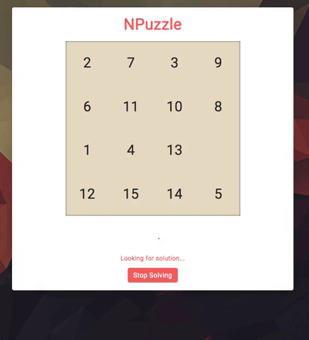

# N-puzzle
The goal of this project is to solve a variable size puzzle (similar to the 15 puzzle problem).
To find a solution from the initial to the final state, the program uses an implementation of the A* algorithm, combined with multiples heuristics available.

In addition to the command line program, a webapp is available, locally or [hosted](https://npuzzle.herokuapp.com/) (takes a few seconds to wake up).



## Usage:
### CLI
Install required Python packages:
```
pip install -r requirements.txt
```

Run:
```
python3 cmd_client.py [-h] [-q] [-t TYPE] {gen,check,solve} ...

NPuzzle solver

positional arguments:
  {gen,check,solve}

optional arguments:
  -h, --help            show this help message and exit
  -q, --quiet           No output
  -t TYPE, --type TYPE  Type of npuzzle: snale, linear
```

For each mode (gen, check, solve), you can get the available options with ```-h```.
```
python3 cmd_client.py solve -h
```

### Webapp
Build:
```
npm run build
```

Run:
```
python3 web_client.py
```
Then access ```http://localhost:5000/``` on your browser.
